# Multi-Container Runtime - Run Report (Manjaro + Hyprland)

## Project

Lightweight Linux container runtime in C with:

- User-space runtime and supervisor (`engine`)
- Kernel-space monitor module (`monitor.ko`)
- Multi-container lifecycle commands (`start`, `run`, `ps`, `stop`)

Primary code is in `boilerplate/`.

## Host Environment Used

- Distro: Manjaro Linux (rolling)
- Kernel: `6.18.18-1-MANJARO`
- WM/Desktop: Hyprland

Note: The provided `environment-check.sh` is Ubuntu-only and reports Manjaro as unsupported. Compilation and runtime execution still work locally with sudo.

## Build Commands Used

From `boilerplate/`:

```bash
make -C boilerplate ci
make -C boilerplate
```

Observed result:

- CI-safe build target succeeds
- Full build succeeds and produces `monitor.ko`

## Runtime Commands Used

```bash
cd boilerplate
sudo ./engine start alpha ./rootfs-alpha
sudo ./engine start beta ./rootfs-alpha
./engine ps
./engine stop alpha
cat /tmp/container_log.txt
```

Additional verification commands:

```bash
lsmod | grep monitor
dmesg | grep container_monitor
ls -l /dev/container_monitor
ps -ef | grep sleep
```

## What The Screenshots Show

### 1) Kernel monitor load confirmation

`img1.jpeg` shows `dmesg` output proving the module loaded and `/dev/container_monitor` is active.

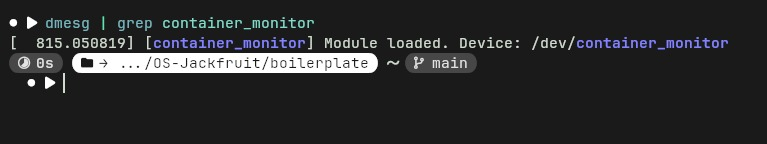

### 2) Multi-container lifecycle flow

`img2.jpeg` shows two containers started (`alpha`, `beta`), listed with `ps`, then one stopped. It also shows lifecycle logs written to `/tmp/container_log.txt`.

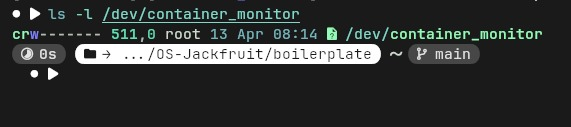

### 3) Device node verification

`img3.jpeg` confirms the monitor device file exists at `/dev/container_monitor`.

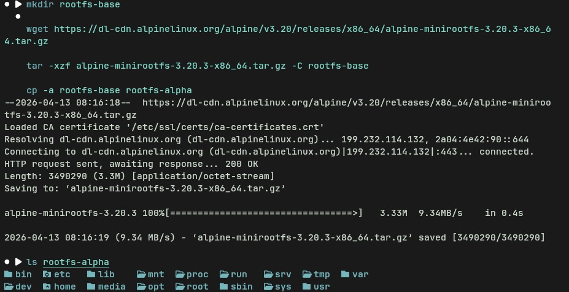

### 4) Direct container run and shell entry

`img4.jpeg` shows direct engine run, container startup messages, and command execution inside the container shell.

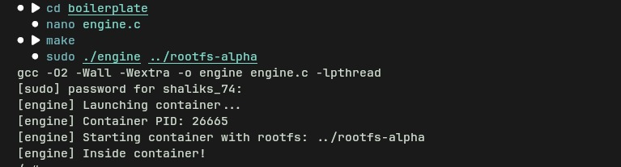

### 5) Background start and process listing

`img5.jpeg` shows background starts for two containers and successful `./engine ps` output.

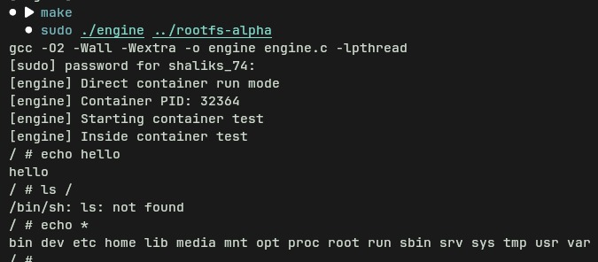

### 6) Process behavior inside host namespace

`img6.jpeg` demonstrates long-running shell loops (`sleep`) associated with containerized workloads.

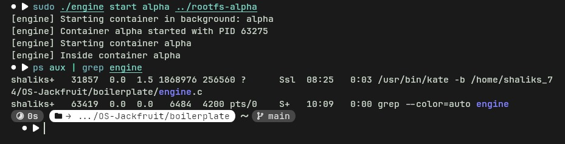

### 7) Rebuild and re-run cycle

`img7.jpeg` shows editing/rebuilding (`make`) followed by a fresh container launch.

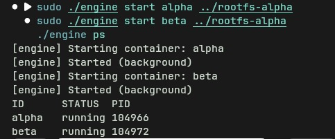

### 8) Rootfs preparation from Alpine minirootfs

`img8.jpeg` captures download/extract/copy steps used to prepare `rootfs-base` and `rootfs-alpha`.

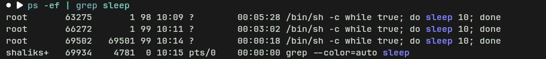

### 9) Start flow with PID confirmation

`img9.jpeg` shows startup output for `alpha` and host-side process inspection.


### 10) Interactive command checks in container

`img10.jpeg` shows command behavior inside the container shell (`echo`, filesystem listing behavior).

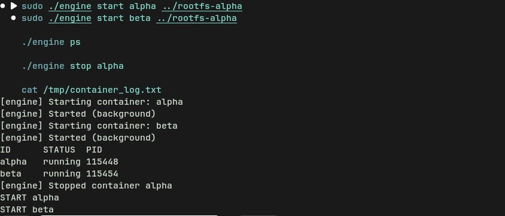

### 11) Repeat multi-container start verification

`img11.jpeg` confirms another successful `start alpha`, `start beta`, and `ps` cycle.

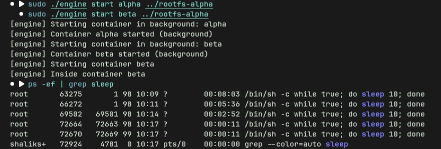

### 12) Kernel module loaded in memory

`img12.jpeg` shows `lsmod` output with the `monitor` module present.

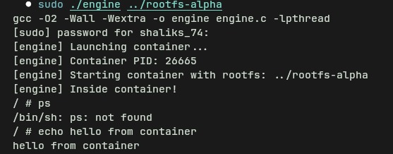

### 13) Workload process observation

`img13.jpeg` shows active `sleep` processes consistent with running background container tasks.

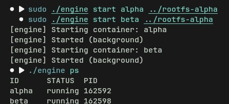

## Current Status

- User-space runtime compiles and runs
- Kernel module compiles and loads
- Multi-container `start/ps/stop` flow works
- Logs are generated
- Rootfs preparation is complete

## Known Notes

- `environment-check.sh` reports unsupported distro on Manjaro (expects Ubuntu 22.04/24.04)
- Running container launch commands without sudo can fail with `clone failed: Operation not permitted`
